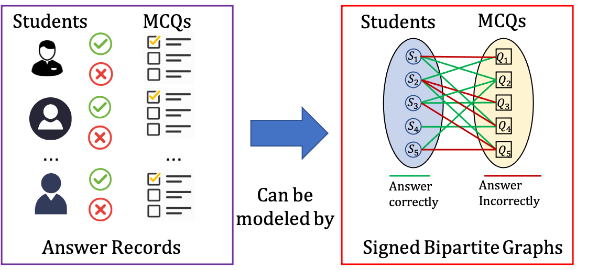

# LLM-SBCL: Predicting Student Performance on Learnersourcing Multiple-Choice Questions using Signed Graph Neural Networks

## Introduction
In online learning platforms, accurately predicting student performance is essential for timely dropout prevention and interventions for at-risk students. Despite the widespread use of Multiple-Choice Questions (MCQs) in learnersourcing platforms for engagement, the accurate prediction of student performance remains challenging due to noise in student-generated content and existing graph-based representations' inability to encode the semantic difference between a correct and wrong response.

Addressing these limitations, we introduce the <u>L</u>arge <u>L</u>anguage <u>M</u>odel enhanced <u>S</u>igned <u>B</u>ipartite graph <u>C</u>ontrastive <u>L</u>earning (LLM-SBCL) model—a novel Multimodal Model utilizing Signed Graph Neural Networks (SGNNs) and a Large Language Model (LLM). Our model uses a signed bipartite graph to represent students' answers, with positive and negative edges denoting correct and incorrect responses, respectively. To mitigate noise impact, we apply contrastive learning to the signed graphs and combine this with knowledge point embeddings from the LLM.



## Project Structure
```console
STUDENT-PERFORMACE-PREDICTION
│   llm_sbcl.py
│   README.md
│   sbcl.py
│
│
├───datasets
│   ├───biology
│   │       data_info.pkl
│   │       edge_index.pt
│   │       glove_300d.pt
│   │
│   ├───cardiff20102
│   │       data_info.pkl
│   │       edge_index.pt
│   │       glove_300d.pt
│   │
│   ├───law
│   │       data_info.pkl
│   │       edge_index.pt
│   │       glove_300d.pt
│   │
│   ├───sydney19351
│   │       data_info.pkl
│   │       edge_index.pt
│   │       glove_300d.pt
│   │
│   └───sydney23146
│           data_info.pkl
│           edge_index.pt
│           glove_300d.pt
│
├───embeddings
│   ├───biology
│   │       glove_300d.pt
│   │
│   ├───cardiff20102
│   │       glove_300d.pt
│   │
│   ├───law
│   │       glove_300d.pt
│   │
│   ├───sydney19351
│   │       glove_300d.pt
│   │
│   └───sydney23146
│           glove_300d.pt
│
├───src
│   └───signed_graph_model
│           model.py
│
└───utils
        load_data.py
        results.py
```

## Run example
To train the model and get results:
```{bash}
: base model
python sbcl.py --rounds=1 --emb_size=64 --mask_ratio=0.2 --dataset=law

: NLP variant
python llm_sbcl.py --rounds=1 --emb_size=64 --lr=1e-2 --num_layers=2 --mask_ratio=.2 --beta=5e-4 --dataset=law
```
> NOTE: 
> - Ensure that the dataset argument matches the name of the dataset folder exactly.
> - For comprehensive hyper-parameter settings, refer to `sbcl.py` and `llm_sbcl.py`.
> - Please be aware that we have not enabled `torch.use_deterministic_algorithms(True)` to accelerate training, which may lead to some fluctuations in the results. 
